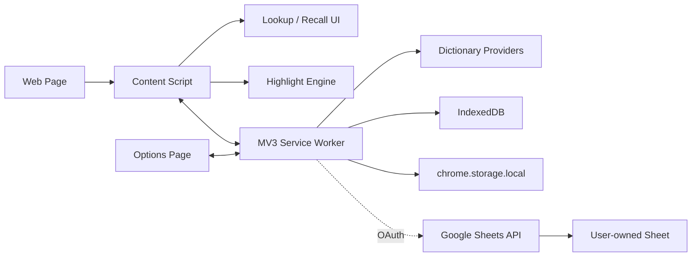

# LexiTrace Project Design

## Product Identity

- English name: LexiTrace
- Chinese name: 詞跡
- Chinese subtitle: 輕量查詞與隱形複習插件
- Repository name: lexitrace

LexiTrace is a browser extension for reading-first English learning. It helps users understand selected words while keeping vocabulary review almost invisible inside normal browsing.

## Source of Truth

The product specification source of truth is `docs/product-spec.md`. Engineering notes in `docs/` should explain implementation decisions, but product behavior should be updated in `docs/product-spec.md` first.

## Technical Decision

The extension should be built in TypeScript, not Python.

Browser extensions run inside the browser process and need direct access to web page selection, DOM traversal, injected UI, background service workers, and browser storage APIs. TypeScript gives the project type safety for vocabulary records, review state, lookup providers, and sync contracts without adding runtime weight.

Python is useful only for optional offline tooling, such as converting dictionary data, generating static TOEIC word lists, or maintenance scripts. If Python is introduced later, it should live under `tools/` and use a local `.venv`.

## Architecture

## Runtime Modules

### Content Script

Responsible for:

- Detecting selected English words or short phrases.
- Capturing the source sentence.
- Rendering lookup popup near the selection.
- Highlighting saved vocabulary in page text.
- Rendering recall-first popup for saved highlights.
- Showing the page vocabulary bubble.

It must never break the host page. Highlighting avoids form fields, editors, code blocks, scripts, styles, and existing LexiTrace UI nodes.

### Background Service Worker

Responsible for:

- Handling runtime messages from content, popup, and options pages.
- Calling dictionary providers.
- Creating and updating vocabulary records.
- Reading and writing IndexedDB.
- Applying recall state transitions.
- Later, managing sync queue dispatch.

### Storage Layer

Phase 1 uses native IndexedDB with these stores:

- `vocabulary`
- `pages`
- `reviews`
- `metadata`

Settings that are small and frequently read use `chrome.storage.local`.

### Dictionary Layer

The provider interface supports:

- `ecdict_cdn`
- `mymemory_translation_api`
- `datamuse_api`
- `wiktapi`
- `local_dictionary`
- `open_dictionary_api`
- `external_dictionary_link`
- future AI or local model providers

Phase 1 uses ECDICT through jsDelivr CDN as the primary English-to-Chinese source, Free Dictionary API and Wiktapi/Wiktionary as structured definition sources, Datamuse as a semantic fallback, MyMemory as a free non-Google Traditional Chinese translation fallback only when dictionary Chinese meanings are missing, and a small local dictionary only as a final fallback.

Lookup providers run in parallel with per-provider timeouts. This keeps the selection popup responsive even when one free API is slow. English words use a small tested word-form module for common plural, tense, progressive, comparison, and irregular forms. Keeping this module local avoids shipping a multi-megabyte linguistic model into every page.

Rejected provider patterns:

- Scraping browser built-in translation popups.
- API proxy services that require bundling secrets into the extension.
- Full dictionary dumps bundled directly into the extension without size review.

Unofficial Google Translate is allowed only as a user-enabled experimental fallback/primary translation option for self-use builds. It is disabled by default, labeled as unstable in settings, and must not be treated as a stable production API.

## Permission Strategy

MVP uses:

- `storage`
- `activeTab`
- `scripting`
- content script access for normal web pages

Passive page highlights require content scripts on visited pages. If the product later wants a stricter permission model, it can move to user-triggered site access with `activeTab`, but the first MVP prioritizes validating the reading loop.

## UI Principles

- Quiet and professional.
- No emoji.
- No full-page translation.
- No large modal for review prompts.
- Recall-first before revealing saved meanings.
- Page highlights are memory cues, not decoration.

## Data Ownership

Default behavior is local-only. The extension stores only selected vocabulary and limited source context. It does not upload full pages, browsing history, or page bodies.

Google Sheet sync remains optional and uses one supported path: `chrome.identity.getAuthToken()` with the official Google Sheets API. Users can create a dedicated user-owned spreadsheet or connect the same spreadsheet on another device. Sync reads both local and remote snapshots, applies deterministic last-write-wins conflict handling using `updated_at` plus a stable tie-breaker, and writes the merged snapshot back to both stores. Auto mode combines a 30-second local-change debounce, 15-minute remote polling, and a 5-minute failure retry.

For Chrome Web Store release, the Google OAuth client ID is a public identifier embedded in `manifest.json`. It should be configured by the publisher at build time and bound to the production Chrome Web Store extension ID. No client secret, service account key, or long-lived token should be bundled.
